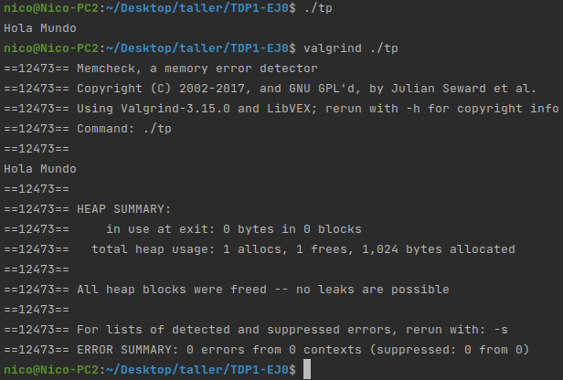

# Contador de palabras
Taller de Programación I - Ejercicio 0\
Nicolás De Giácomo\
99702

## Contenido
* [Paso 0](#paso-0-entorno-de-trabajo)
    * [Hola Mundo](#aplicacin-hola-mundo)
    * [Valgrind](#utilidad-de-valgrind)
    * [Instrucción `sizeof`](#qu-representa-sizeof)
    * [Estructuras y `sizeof`](#estructuras-y-sizeof)
    * [Archivos estándar](#archivos-estndar)

## Paso 0: Entorno de Trabajo
Se preparó un ambiente local con las siguientes características:
- Ubuntu Focal 20.04
- GCC 9.3.0
- Valgrind 3.15.0
- GDB 9.2

### Aplicación "Hola Mundo"
Se programó una aplicación que imprime "Hola Mundo" en la pantalla y retorna 0.


### Utilidad de Valgrind
Valgrind es un programa utilizado para la detección de errores en el manejo de la memoria (heap) de las aplicaciones.\
Dentro de las opciones más comunes se encuentran:
- `-q` _(quiet)_. Configura a Valgrind para que se ejecute "silenciosamente", es decir, imprimiendo menos mensajes (solamente los errores).
- `-v` _(verbose)_. Lo contrario a `-q`, configura a Valgrind para que imprima información extra.
- `-s` _(show error list)_. Al final de la ejecución muestra una lista con los errores detectados.
- `-h` _(help)_. Muestra el mensaje de ayuda.

### ¿Qué representa `sizeof()`?
La instrucción `sizeof()` devuelve un entero que representa la cantidad de **bytes** que ocupa el tipo de variable que recibe por parámetro.\
En la arquitectura descrita anteriormente el resultado de la llamada a `sizeof()` sería 1 para el tipo `char` y 4 para el tipo `int`.

### Estructuras y `sizeof()`.
Cuando se llama a la función `sizeof()` y se pasa como parámetro una estructura, el resultado no es necesariamente la suma de los `sizeof()` de cada tipo individual.\
Por ejemplo, se puede tener una estructura en la que el compilador deje un espacio de **bytes** sin modificar llamado **padding**.\
A continuación se presenta un ejemplo de cada caso.\
En el primer ejemplo se puede observar una estructura que no utiliza **padding**.
```
struct Example {
    int a;
    int b;
};
```
Si utilizamos `sizeof()` en esta estructura, el resultado será la suma de los `sizeof()` de sus elementos.


Ahora, tenemos una nueva estructura que utiliza padding luego del primer elemento.
```
struct Example {
    char c;
    int a;
    int b;
};
```
En este caso el `sizeof` de la estructura es mayor que el `sizeof` de la suma de sus elementos.


### Archivos estándar
Los archivos estándar corresponden a tres streams (canales de comunicación) de datos definidos por el sistema.
- `STDIN` _Standard Input_. Utilizado por los programas para leer los datos de entrada. 
- `STDOUT` _Standard Output_. Utilizado para escribir la salida de un programa.
- `STDERR` _Standard Error_. Archivo independiente de `STDOUT`, en el cuál se escriben los mensajes de error.

Estos archivos pueden ser redirigidos a través del **pipeline**. Este es un mecanismo que permite la comunicación entre diferentes programas.\
Utilizando el símbolo **pipe** (`|`), se pueden conectar las todas las salidas estándar entre procesos.

```
comando1 | comando2
```
Utilizando el símbolo `>` se puede redireccionar la salida de un proceso con la entrada de otro.
```
comando1 > comando2
```

