# Ejercicio 0 - Contador de palabras
Taller de Programación I - Ejercicio 0\
Nicolás De Giácomo\
99702

## Contenido
* [Paso 0](#paso-0-entorno-de-trabajo)
  * [Hola Mundo](#aplicación-hola-mundo)
  * [Valgrind](#utilidad-de-valgrind)
  * [Instrucción `sizeof`](#qué-representa-sizeof)
  * [Estructuras y `sizeof`](#estructuras-y-sizeof)
  * [Archivos estándar](#archivos-estándar)
* [Paso 1](#paso-1-sercom---errores-de-generación-y-normas-de-programación)
  * [Problemas de estilo](#problemas-de-estilo)
  * [Errores de generación del ejecutable](#errores-de-generación-del-ejecutable)
  * [Warnings](#warnings)
* [Paso 2](#paso-1-sercom---errores-de-generación-y-normas-de-programación)
  * [Correcciones](#correcciones)
  * [Errores en las normas](#errores-en-las-normas)
  * [Errores en la generación del ejecutable](#errores-de-generacin-del-ejecutable-2)
* [Paso 3](#paso-1-sercom---errores-de-generación-y-normas-de-programación)
  * [Correcciones](#correcciones-3)
  * [Errores en la generación del ejecutable](#errores-de-generacin-del-ejecutable-3)
* [Paso 4](#paso-1-sercom---errores-de-generación-y-normas-de-programación)
  * [Correcciones](#correcciones-3)
  * [Prueba _TDA_](#prueba-_tda_)
  * [Prueba _Long Filename_](#prueba-_long-filename_)
  * [Segmentation Fault y Buffer Overflow](#segmentation-fault-y-buffer-overflow)

## Paso 0: Entorno de Trabajo
Se preparó un ambiente local con las siguientes características:
- Ubuntu Focal 20.04
- GCC 9.3.0
- Valgrind 3.15.0
- GDB 9.2

### Aplicación "Hola Mundo"
Se programó una aplicación que imprime "Hola Mundo" en la pantalla y retorna 0.

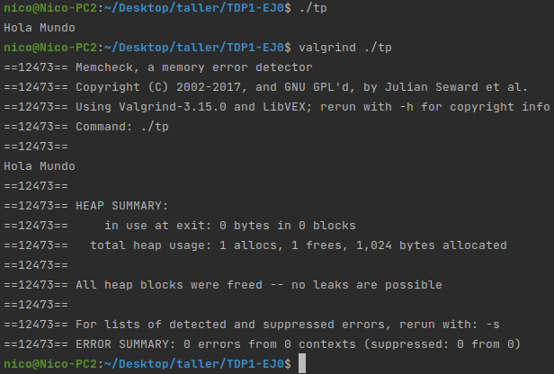

### Utilidad de Valgrind
Valgrind es un programa utilizado para la detección de errores en el manejo de la memoria (heap) de las aplicaciones.\
Dentro de las opciones más comunes se encuentran:
- `-q` _(quiet)_. Configura a Valgrind para que se ejecute "silenciosamente", es decir, imprimiendo menos mensajes (solamente los errores).
- `-v` _(verbose)_. Lo contrario a `-q`, configura a Valgrind para que imprima información extra.
- `-s` _(show error list)_. Al final de la ejecución muestra una lista con los errores detectados.
- `-h` _(help)_. Muestra el mensaje de ayuda.

### ¿Qué representa `sizeof()`?
La instrucción `sizeof()` devuelve un entero que representa la cantidad de **bytes** que ocupa el tipo de variable que recibe por parámetro.\
En la arquitectura descrita anteriormente el resultado de la llamada a `sizeof()` sería 1 para el tipo `char` y 4 para el tipo `int`.

### Estructuras y `sizeof()`.
Cuando se llama a la función `sizeof()` y se pasa como parámetro una estructura, el resultado no es necesariamente la suma de los `sizeof()` de cada tipo individual.\
Por ejemplo, se puede tener una estructura en la que el compilador deje un espacio de **bytes** sin modificar llamado **padding**.\
A continuación se presenta un ejemplo de cada caso.\
En el primer ejemplo se puede observar una estructura que no utiliza **padding**.
```
struct Example {
    int a;
    int b;
};
```
Si utilizamos `sizeof()` en esta estructura, el resultado será la suma de los `sizeof()` de sus elementos.


Ahora, tenemos una nueva estructura que utiliza padding luego del primer elemento.
```
struct Example {
    char c;
    int a;
    int b;
};
```
En este caso el `sizeof` de la estructura es mayor que el `sizeof` de la suma de sus elementos.


### Archivos estándar
Los archivos estándar corresponden a tres streams (canales de comunicación) de datos definidos por el sistema.
- `STDIN` _Standard Input_. Utilizado por los programas para leer los datos de entrada.
- `STDOUT` _Standard Output_. Utilizado para escribir la salida de un programa.
- `STDERR` _Standard Error_. Archivo independiente de `STDOUT`, en el cual se escriben los mensajes de error.

Estos archivos pueden ser redirigidos a través del **pipeline**. Este es un mecanismo que permite la comunicación entre diferentes programas.\
Utilizando el símbolo **pipe** (`|`), se pueden conectar las todas las salidas estándar entre procesos.

```
comando1 | comando2
```
Utilizando el símbolo `>` se puede redireccionar la salida de un proceso.
```
comando1 > comando2
```
Utilizando el símbolo `<` se puede redireccionar la entrada de un proceso.
```
comando1 < comando2
```
## Paso 1: SERCOM - Errores de generación y normas de programación
### Problemas de estilo
En el programa se detectaron once problemas de estilo que van a ser descritos a continuación.

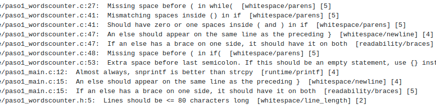

1. En la línea `paso1_wordscounter.c:27` debe haber un espacio entre el _while_ y el paréntesis posterior.
2. En la línea `paso1_wordscounter.c:41` la sentencia dentro del _if_ tiene diferente cantidad de espacios a la derecha y a la izquierda.
3. En la línea `paso1_wordscounter.c:41` la sentencia dentro del _if_ debería tener solamente uno o ningún espacio que lo separe del paréntesis correspondiente.
4. En la línea `paso1_wordscounter.c:47` la instrucción `else` debería estar ubicada en la misma línea que el cierre de llaves del _if_ correspondiente.
5. En la línea `paso1_wordscounter.c:47`, si una instrucción _else_ tiene una llave de un lado, debería tenerla de ambos.
6. En la línea `paso1_wordscounter.c:48` debería haber un espacio entre la instrucción _if_ y el paréntesis siguiente.
7. En la línea `paso1_wordscounter.c:53` hay un espacio extra previo al símbolo `;`.
8. En la línea `paso1_main.c:12` debería usarse la instrucción `snprintf` en lugar de `strcpy`.
9. En la línea `paso1_main.c:15` se encuentra el mismo problema que el descrito en el ítem 4.
10. En la línea `paso1_main.c:15`, se encuentra el mismo problema que el descrito en el ítem 5.
11. En la línea `paso1_wordscounter.h:5` se supera el máximo sugerido de 80 caracteres.

### Errores de generación del ejecutable
Dentro de los errores detectados durante la generación del ejecutable encontramos el error _implicit declaration of function_ que se repite en cuatro líneas (23, 24, 25 y 27) dentro del archivo _main.c_.
Este error hace referencia a que se está usando una función que no se declaró anteriormente.\
Se trata de un error en la etapa de compilación.

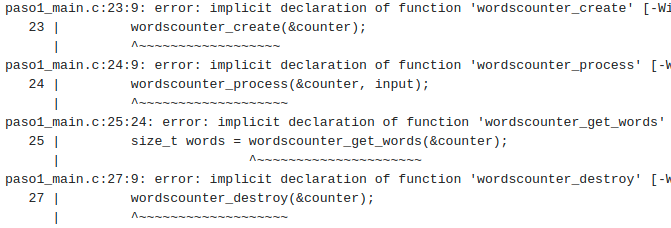

Luego, también podemos encontrar el error _unknown type name_ que ocurre en la línea 22 del archivo _main.c_.
Este error nos indica que el tipo en cuestión (_wordscounter_t_) no fue definido previamente.\
Se trata de un error en la etapa de compilación.

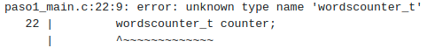

### Warnings
El sistema no reportó ningún warning debido al flag `-Werror` utilizado al compilar. Este flag le indica al compilador que todos los warnings detectados deben ser tratados como errores.

## Paso 2: SERCOM - Errores de generación 2
### Correcciones
En el archivo **main.c**:
- Se incluyó el archivo `wordscounter.h` que contiene definiciones.
- Se reemplazó la función `strcpy` por `memcpy`.
- Se puso la instrucción _else_ en la misma línea que el cierre de llaves del _if_ anterior.

En el archivo **wordscounter.c**:
- Se realizaron correcciones de estilo en las líneas 13, 26, 40, 45, 46 y 51.

En el archivo **wordscounter.h**:
- Se arregló el largo de la línea 5.

### Errores en las normas
No se detectaron problemas en las normas controladas por **Cpplint**.

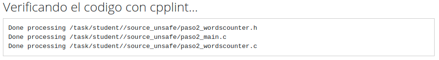

### Errores de generación del ejecutable 2
En la generación del ejecutable se presentaron los siguientes errores.

Hubo tres instancias en las que se detectó el error _unknown type name_. Este es un error del compilador que se debe a un tipo no reconocido (no declarado previamente).\
Para ayudar con este error, el compilador indica que el tipo `FILE` está definido en la librería `<stdio.h>` y el tipo `size_t` en la `<stddef.h>`.

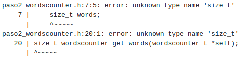
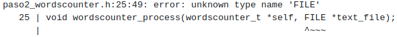

Luego, se obtiene el error _conflicting types_. Este es un error del compilador que está indicando que una función está siendo declarada por una segunda vez, con un tipo diferente de la primera declaración.

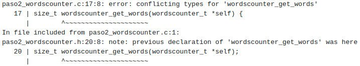

Por último, tenemos el error _implicit declaration of function_. Este es un error del compilador que nos indica que cierta función (en este caso la función `malloc`) no fue declarada antes de ser invocada.\
El compilador provee un mensaje de ayuda indicando que la librería `<stdlib.h>` tiene una declaración de esta función.

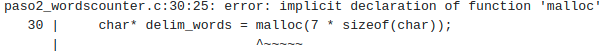

## Paso 3: SERCOM - Errores de generación 3
### Correcciones 2
En el archivo **wordscounter.c**:
- Se importó la librería `<stdlib.h>`.

En el archivo **wordscounter.h**:
- Se importó la librería `<string.h>`.
- Se importó la librería `<stdio.h>`.

### Errores de generación del ejecutable 3
Se obtuvo un único error: _undefined reference_. Este es un error del linker, que está indicando que una función que fue **declarada** (por eso no falló el compilador) nunca fue **definida**.

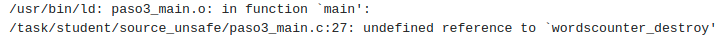

## Paso 4: SERCOM - Memory Leaks y Buffer Overflows
### Correcciones 3
Se agregó la definición de la función _wordscounter_destroy_ en el archivo **wordscounter.c**.

### Prueba _TDA_
En la ejecución con _Valgrind_ de la prueba _TDA_ se encontraron los siguientes errores.

Primero, un file descriptor no fue cerrado antes del término de la ejecución.

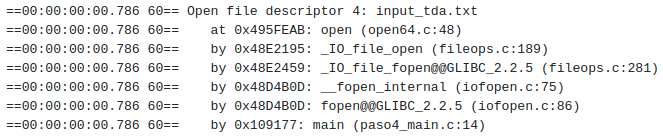

Segundo, se encontraron problemas con el manejo de la memoria que dejaron _leaks_.


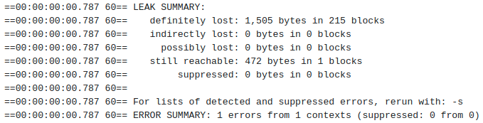

### Prueba _Long Filename_
En la ejecución con _Valgrind_ de la prueba _Long Filename_ se encontró un _buffer overflow_ al usar `memcpy` en la línea `paso4_main.c:13`.

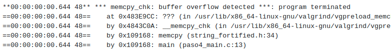

El error se podría solucionar utilizando la función `strncpy`. Sin embargo, esto podría un límite de caracteres al nombre del archivo que de ser superado hará que el programa devuelva un código de error (no va a encontrar el archivo teniendo el nombre incompleto).

### Segmentation Fault y Buffer Overflow
Un _Segmentation Fault_ se obtiene cuando se quiere acceder a una parte de la memoria a la cual no se tiene permisos. Por ejemplo, cuando por error se intenta modificar un espacio de memoria dentro del _Code Segment_.

Un _Buffer Overflow_ se obtiene cuando se intenta guardar datos dentro de un _buffer_ (por ejemplo un arreglo) con un largo que supera al mismo. Esto provoca que se corrompan (remplacen sus datos) los segmentos de memoria adyacentes al _buffer_.

## 5. Paso 5: SERCOM - Código de retorno y salida estándar
### 5.1. Correcciones
En el archivo `wordscounter.c` previo, el array con los caracteres delimitadores de palabras se guardaba en el _heap_ utilizando `malloc`. En la nueva versión se utiliza una constate y el programador ya no debe encargarse de la liberación de este espacio de memoria.

En el archivo `main.c` se corrigió el problema con la función `memcpy` y ahora para el llamado a la función `fopen` se utiliza el argumento recibido por parámetro sin alamacenar los datos en otra variable.\
Por otro lado, se agregó el cierre del archivo (en caso de que no sea el estándar) al final del programa.

### 5.2. Pruebas _Invalid File_ y _Single Word_
En el caso de la prueba _Invalid File_ se espera que se retorne un **1** (código de error), pero se obtiene un **255** del programa.

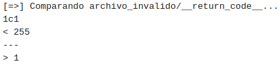

En el caso de la prueba _Single Word_ se espera que el programa retorne el resultado **1** (una palabra contada), pero retornó el resultado **0**.

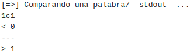

### 5.3. Hexdump

Utilizando la herramienta hexdump se puede ver que el archivo `input_single_word.txt` contiene 4 caracteres, siendo el último el caracter con ASCII 0x64 **'d'**.
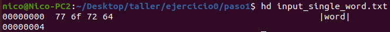

### 5.4. GDB
Se utilizaron los siguientes comandos:
- `info functions`: Lista las funciones declaradas por archivo.
- `list wordscounter_next_state`: Muestra la definición de la función.
- `break 45`: Coloca un _breakpoint_ en la línea 45 
- `run input_single_word.txt`: Ejecuta el programa con el parámetro correspondiente.
- `quit`: Sale de la herramienta GDB.

En _debugger_ no se detuvo en la línea 45, ya que, esta línea nunca se ejecuta. Esto se puede ver claramente observando que el programa retorna 0 palabras contadas para este archivo.\
La ejecución del programa termina (erróneamente) antes de sumar 1 a la variable que contiene la cantidad de palabras contadas hasta el momento.

## 6. Paso 6: SERCOM - Entrega exitosa
### 6.1. Correcciones
En el archivo `main.c` se corrigió el _status code_ devuelto en caso de error.

En el archivo `wordscounter.c`, se pasó a utilizar un `define` para la cadena de caracteres delimitadores. Luego, se arregló la lógica dentro de la función `wordscounter_next_state` (ver [5.2 Pruebas](#52-pruebas-_invalid-file_-y-_single-word_) y [5.2 GDB](#54-gdb)).

### 6.2. Entregas realizadas
A continuación se muestran las entregas realizadas hasta el momento.


### 6.3. Ejecución local
A continuación se muestra la ejecución local de la prueba _Single Word_

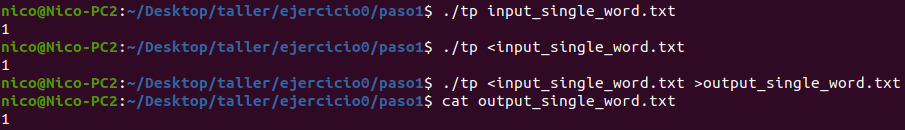

## Paso 8: SERCOM - Netcat, ss y tiburoncin
Docu
